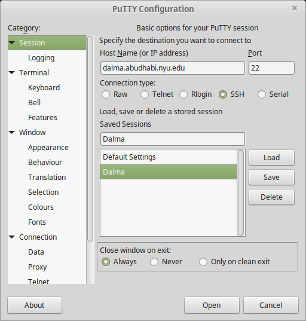

Access Dalma
============

Want to access Dalma? Follow the guide below for Linux / Mac and Windows.

Linux / Mac
------------

**Inside NYU Network**

For Linux/Mac, execute the following command, change ``<NetID>`` to your actual username.

.. code-block:: bash

    ssh <NetID>@dalma.abudhabi.nyu.edu

If you need ``X11``, add the ``-X`` option.

.. code-block:: bash

    ssh <NetID>@dalma.abudhabi.nyu.edu -X

Outside NYU Network
-------------------
**VPN**

You could either first connect to NYU VPN (See `here <https://www.nyu.edu/life/information-technology/getting-started/network-and-connectivity/vpn.html>`__ for instruction) and then connect to Dalma directly. Choose ``vpn.abudhabi.nyu.edu`` as your VPN server.

**Bastion Host**
Or, use bastion host as instructed below.

1. Connect to bastion host.

.. code-block:: bash
    
    ssh <NetID>@hpc.abudhabi.nyu.edu -p 4410

2. On bastion host, connect to Dalma.

.. code-block:: bash
    
    ssh <NetID>@dalma.abudhabi.nyu.edu

To make a things easier, you could set up a tunnel configuration.

1. Add the following to your ``$HOME/.ssh/config`` on your local workstation. Replace ``<NetID>`` with your actual ``NetID``. Make sure your local port 8023 is available.

.. code-block:: bash

 Host tunnel-ad-hpc
    HostName hpc.abudhabi.nyu.edu
    Port 4410
    ForwardX11 yes
    LocalForward 8023 dalma.abudhabi.nyu.edu:22
    User <NetID>

 Host tunnel-dalma
    HostName localhost
    Port 8023
    ForwardX11 yes
    User <NetID>

2. Open a terminal. Run the following and keep this terminal alive.

.. code-block:: bash

    ssh tunnel-ad-hpc

3. Open a new terminal. Run the following to connect to Dalma.

.. code-block:: bash

    ssh tunnel-dalma

4. If you want to transfer data instead, use the following example.

.. code-block:: bash

    rsync -rav ./local-folder-to-upload tunnel-dalma:/scratch/<NetID>/remote-folder-on-dalma

Windows
-------

**Inside NYU Network**

We recommend Mobaxterm/Putty as your ssh client. Putty is available for download here: http://www.chiark.greenend.org.uk/~sgtatham/putty/download.html. 

1. (First-time login only) Setup Butinah session in your putty.
    a. Open Putty. Go to Category -> Session. 
    b. Type dalma.abudhabi.nyu.edu in Host Name (or IP address).
    c. Type Dalma under Saved Sessions.
    d. Click Save button. A new session called Dalma will appear in Saved Sessions. 

2. Select Dalma session. Click Load button. 
3. Click Open button.

The configuration will look like this screenshot.

**Outside NYU Network**

You could either first connect to NYU VPN (See `here <https://www.nyu.edu/life/information-technology/getting-started/network-and-connectivity/vpn.html>`__ for instruction) and then connect to Dalma directly. Choose vpn.abudhabi.nyu.edu as your VPN server.

Or, use bastion host as instructed below.

1. Follow the instructions above as in side NYU Network, but connect to the host **hpc.abudhabi.nyu.edu** with port **4410** instead of dalma.abudhabi.nyu.edu.
2. Once you are connected, run this in the terminal on hpc.abudhabi.nyu.edu

.. code-block:: bash

    ssh <NetID>@dalma.abudhabi.nyu.edu

Now you are on Dalma.