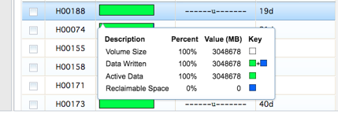
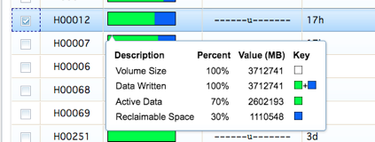
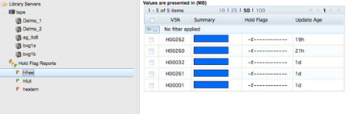
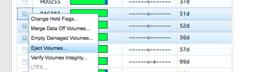
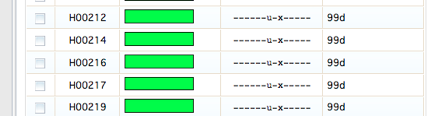
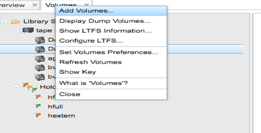
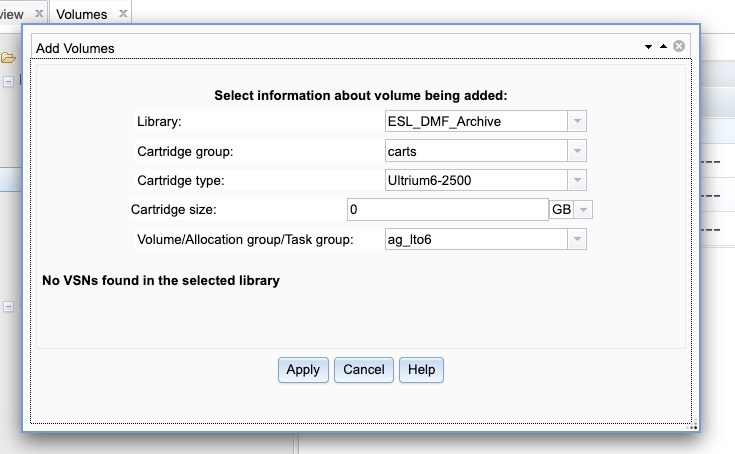

DMF archive offsite tape operation
==================================

The tape volume group Dalma_2 tapes will be send to offsite in order to prevent any single point of failure on users archive data. The tapes in group Dalma_1 will be inside the Library for time being until we see any requirements to offload those as well.  The below steps to be followed whenever want to offload any tapes from the library.

DMF Manger: This tool is being used to manage overall DMF operations. This can be accessed internally from an active DMF server node. Eg: https://10.0.0.90:11109/

Once login go to -> Storage-> Volumes -> tape -> Dalma_2 this will show all tapes used for tape volume group Dalma_2. Before ejecting any tapes just make sure that the tape has been fully utilized for writing.  For example, click on any tapes with full green color we can see Data is written is 100% and the tapes is not being access for 30 days which eligible for send to offsite.

And if any user deletes data from /archive/userx corresponding data will be deleted from tape as well. But DMF will mark the space as reclaimable space in blue color which means in order to reuse the space we need to sparse the tape. The tape sparse spawned automatically by DMF but as per the current schedule if the tape is having less than 30% active data then only the tape will be sparse. This ratio can be changed if the user’s deletion is more frequent than anticipated which can result more tapes will have reclaimable space and if the active data is more than 30% we lose space on tapes. However, if we want to sparse the tape we have to merge the data off manually.

For example, the below- Figure2 tape H00012 has around 1TB of reclaimable space and active data is 70% so this tape will not be parsed unless it goes to 30%. In this case we can manually select this tapes to merge data off volumes. So active data will be copied over to a different tape and we can reuse this tape.

 

When any tapes parsed those will be hold “hfree” flag for some days to go to empty one. These all operations are happening internally so need to do anything from our side.

Once we identified the tapes to be offloaded from library select all those tapes and click on eject volumes. At a time, the library will eject only 24 volumes as it have only 24 male slots and once we collect ejected tapes from library rest tapes will be processed.

After we offload the ejected tapes from library those tapes flags will be changed to “hexterm” as shown in Figure-5

 

Adding new tapes to Library

Whenever we add new tapes to library add insert in male slots so it automatically feed the empty slots with new tapes and will appear in the Volumes. Then right click on volumes ->Add Volumes

Then select all new tapes on the window except those cleaning tapes. Also make sure change the Library as "ESL_DMF_Archive" ,Cartridge type as " Ultrium6-2500" and allocation group to ‘ag_lto6’ as shown in Figure- 7 where all the new DMF compliance tapes will be added. From this group DMF will assign the tapes to Dalma_1 or 2 whenever needed.

 

Removing damaged tapes from Library

If any tapes reports I/O error DMF will put the flag as hvfy (Append error) on those media and no more writing will be happen afterwards. So we in that case generally we migrate the existing data on the tape and remove the tape from library to scratch it.

Once we merge the data from the tape eject and remove it from the library and run below commands to delete the record from DMF database and catalogue database.

dmvoladm -c "list hvfy"  --------> list the tapes with hvfy flag

dmvoladm -c "delete ECJ889"  ---------> delete from DMF database

ov_purge -vB ECJ889    -----------> delete from DMF catalogue database