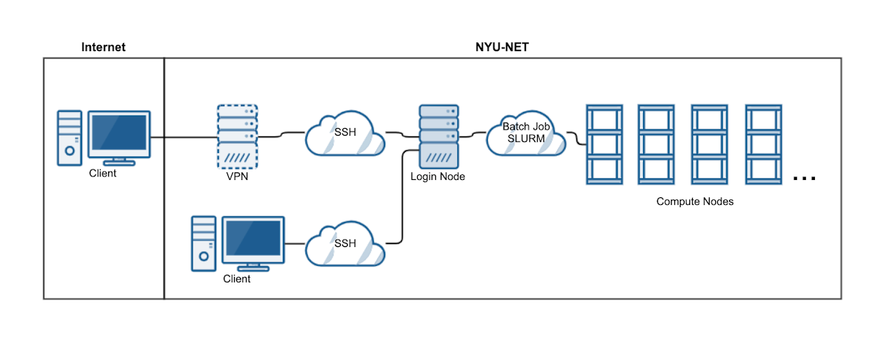

System
======

Overview
--------

The operating system on Dalma is Linux. Make sure you know the basics. Useful links:

* http://linuxcommand.org/
* http://software-carpentry.org/lessons/
* https://www.edx.org/course/introduction-linux-linuxfoundationx-lfs101x-0

Generic diagram of the cluster architecture and outside connectivity.
