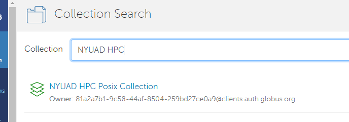

Globus Data Transfer
====================

Globus is a service that makes it easy to move, sync, and share large amounts of data. 
Globus will manage file transfers, monitor performance, retry failures, recover from faults 
automatically when possible, and report the status of your data transfer. Globus uses GridFTP 
for more reliable and high-performance file transfer, and will queue file transfers to be 
performed asynchronously in the background.

Globus was developed and is maintained at the University of Chicago and is used extensively at 
supercomputer centers and major research facilities [`Globus Website <http://www.globus.org/>`__ ].

The NYUAD HPC is also part of the Globus network.**Globus can be used for both file transfers between NYUAD HPC and a 
computing institution with Globus installed**. Researchers can benefit from the above by using ``$WORK``
as the mountpoint. 

.. Important::
    The Globus Endpoint has ``$WORK`` automatically mounted. Users can access the same in the Globus portal by specify ``/NetID``. This will correspond to ``/work/Netid``.

When to use Globus?
-------------------

For transferring small amounts of data, the scp, sftp, and rsync over ssh utilities generally 
work well and are more widely available. However, if you transfer large data that takes a long time 
(more than 15 minutes) and happens frequently, or is using an unreliable connection, Globus is 
recommended. This is because Globus not only transfers data faster but also takes care of 
disruptions gracefully (e.g., automatically resumes data transfer after temporary 
network disconnections). 

**To use Globus, it needs to be available on both source and destination endpoints.**

One Time Setup
--------------

Follow the below steps to connect to the Globus Network

- Log into NYUAD HPC
- In login node, execute the command ``globus-keyinit``.
    
.. note:: 
    The above command makes sure that globus DMZ server will be able to login to CNG/Login nodes without password

- Once the above command is executed, it outputs a command to copy the private key to the bastion host. Please execute it and proceed.

Globus Portal
-------------

Connect to the Globus portal ( www.globus.org ) using the institute credentials (NetId and Password)
and browse for the ``NYUAD HPC Posix collection``.

You can now Trasnfer or sync data available within the globus network.

The screenshot below is a trasnfer to be initiated between one of the dataset from "NCAR's Research Data Archive"
to ``/work/wz22`` of NYUAD HPC.

    .. image:: ../img/globus3.png

The Globus organization provides a series of `How To <https://docs.globus.org/how-to/>`__ documents 
including a `Getting Started Guide <https://docs.globus.org/how-to/get-started/>`__ that covers 
logging in and transferring files.

