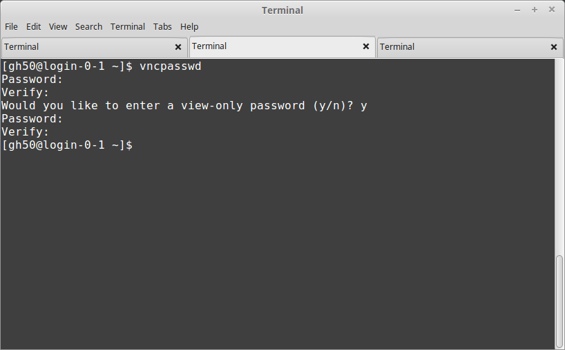
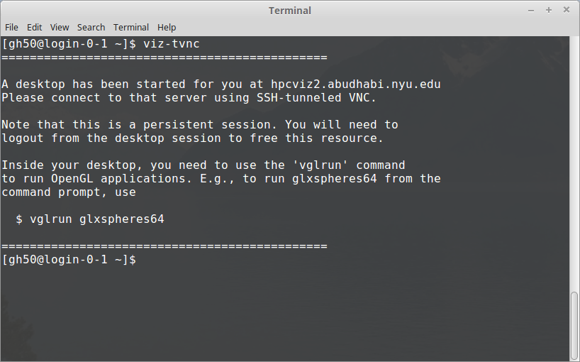
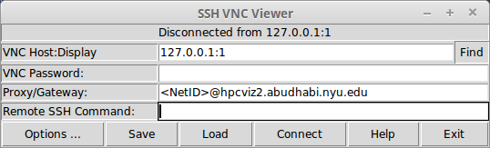
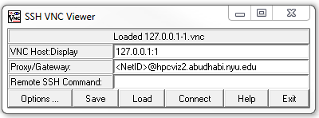
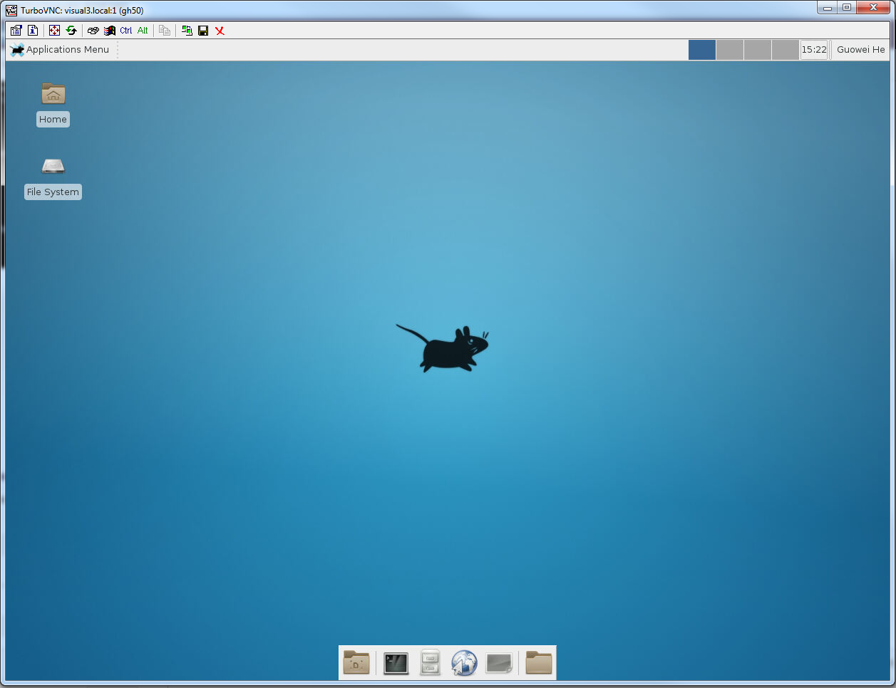

Visualization Nodes
===================

Introduction to the Visualization Nodes
---------------------------------------
The Visualization Nodes is a High Performance Computing resource that provides an advanced visualization capability to the end user's desktop. Users can connect to the nodes and take advantage of its advanced capabilities to render very large data sets interactively from their desktops without having any special graphics hardware on their workstation. The images are sent back to the user's desktop over the network and displayed on the desktop using a lightweight visualization client.

The Visualization nodes consists of 4 render nodes. Multiple users can share a node. Each node has access to the same /home and /archive shared file system on the HPC nodes.

To run any visualization software interactively on the nodes you will first need to connect to the login node and request resources. In simple terms, the login node will check which nodes in the nodes are available for you and will consequently allocate you the requested resources. You can then connect to your given visualization node and start your visualization session there.

Remote visualization method on the visualization nodes is implemented using Virtual Network Computing (VNC). VNC is a desktop sharing system which uses a protocol to remotely control another computer (one of the visualization nodes for example). It transmits the keyboard presses and mouse clicks from one computer to another relaying the screen updates back in the other direction, over a network.

Visualization nodes hardware and software
-----------------------------------------
The visualization nodes have an Intel x86-64 architecture with CentOS 7.2 operating system. Each visualization render node has:

* 32 cores Intel Xeon 6130 2.1GHz CPU
* 112GB of RAM
* 2 Nvidia Quadro P4000 GPU

Software on the visualization nodes can be accessed through the environment module system (module commands). Currently installed software includes Paraview, IDL, PyMOL, VMD, and Matlab.

Remote visualization session through VNC
----------------------------------------
A remote visualization session consists of connecting a Virtual Network Computing (VNC) client to a VNC server on a different computer over the network.

To connect to the nodes via a remote visualization session, you will first need to download a VNC client software on your local machine. The standard VNC client software which has been tested for connecting to the visualization nodes is SSVNC (http://www.karlrunge.com/x11vnc/ssvnc.html).

**Before you can request a remote visualization session on the login node, and then start a session on your allocated node on the nodes, you will have to first create a VNC password.**

Starting a remote visualization session
---------------------------------------
A quick guide to start a VNC session on the visualization nodes is given in the following steps:

1. (**Necessary only once**) create a VNC password;
2. SSH to the login node and request resources via the command ``viz-tvnc`` (or ``viz-tvnc -X``);
3. Start a VNC client on your local machine and connect to your allocated node; 
4. Start a 3D application inside your VNC session.

More detail descriptions of the steps above are given in the subsections below.

Creating a VNC password (necessary only once)
---------------------------------------------
If this is your first time using a remote VNC session on the visualization nodes, you need to create a VNC password. 

While logged in to the login node type vncpasswd in the terminal window and follow the instructions.

.. code-block:: bash

    vncpasswd

 

Note that you do not need to enter a view-only password. This is an extra option that allows collaborators to connect to and view your session without being able to interfere.

**This above step can be repeated whenever your VNC password needs to be changed.**

Requesting resources
--------------------
While logged in to the login node, you can request an allocation of a visualization node by typing

 
.. code-block:: bash

    viz-tvnc

in the terminal window. If you need to use GPU-enabled application, run ``viz-tvnc -X``.

.. code-block:: bash

    viz-tvnc -X11

This will allocate a single visualization node for your exclusive use for a limited time period (presently 6 hours max usage). The node allocated below, for example, is ``hpcviz2.abudhabi.nyu.edu``.

You can specify the geometry (size) of the remote visualization session when starting viz-tvnc with the -g option:

.. code-block:: bash

    -g DESKTOP_RESOLUTION

The resolution to run the desktop at. This can be any "<width>x<height>" value, and doesn't need to match any display device resolution.

Installing a VNC client
-----------------------
We kindly ask users to use ssvnc, available on Linux, MacOS and Windows.You could install it from zip or tar.gz, or from package manager if you are using Ubuntu / Debian.

**Installing from zip**

.. admonition:: For MacOS

    First you need to install X11 support here: https://www.xquartz.org/.

This approach is valid for Windows, MacOS and Linux / Unix.

1. Download this file: ssvnc-1.0.30.zip. For all versions, http://www.karlrunge.com/x11vnc/ssvnc.html#download.
2. Install it by following the instructions here: http://www.karlrunge.com/x11vnc/ssvnc.html#quickstart

**Installing from package manager**
Alternatively, for Debian / Ubuntu, you could install it by

.. code-block:: bash

    apt-get install ssvnc

Starting a VNC client
---------------------
To make a secured VNC client-server connection, please follow the instructions below.  

If ssvnc is installed from zip
After you extracted the zip file ssvnc-1.0.30.zip, the content looks like

For Linux / Unix, the executable you want to execute is

.. code-block:: bash

    Unix/sshvnc

For Mac, the executable you want to execute is

.. code-block:: bash

    MacOSX/sshvnc

For Windows, the executable you want to execute is

.. code-block:: bash

    Windows/sshvnc.bat

If ssvnc is installed from package manager
In a new terminal, you can start the  viewer as follow:

.. code-block:: bash

    sshvnc

**Connecting a VNC client**

Once the client is started, you need to instruct it to connect to the visualization server. Here is the example screen shot for connecting to your session. Change <DisplayNumber>, <NetID>@<Visualization host assigned to you> in the example to your actual Display Number, NetID and the host assigned to you.

    +-------------------------+--------------------------------------------------+
    | VNC Host:Display        | 127.0.0.1:<DisplayNumber>                        |
    +-------------------------+--------------------------------------------------+
    | Proxy/Gateway           | <NetID>@<Visualization host assigned to you>     |
    +-------------------------+--------------------------------------------------+
  

**Linux / MacOS Screenshot (Display: 1, Host: hpcviz2.abudhabi.nyu.edu)**

**Windows Screenshot (Display: 1, Host: hpcviz2.abudhabi.nyu.edu)**

.. admonition:: Cursor

    By default the cursor is a single pixel dot, and difficult to see. To change it in Linux, enable the following option in SSH VNC Viewer.
    
    .. code-block:: bash
    
        Options -> Advanced ... -> Unix ssvncviewer ... -> Use X11 Cursor

    To change it in Windows, please follow the instructions below first.

Click **Connect**. A new window will pop up.

The first time you attempt to connect to the visualization node, you will probably see a warning that looks like this.

.. code-block:: 

    The authenticity of host 'HPCVIZ1.ABUDHABI.NYU.EDU (10.230.42.111)' can't be established.
    ECDSA key fingerprint is
    74:55:46:1a:ab:37:30:8e:86:54:97:38:bb:3c:fa:f0.
    Are you sure you want to continue connecting (yes/no)?

Type ``yes`` to continue.

**Then it might ask you for 2 passwords:**

* (Not applied if you have your ssh key stored on HPC). Your ssh password. This is essentially your login password to HPC.
* Your VNC password. Set up earlier in this tutorial.

.. admonition:: For Certain MacOS Users

    Some MacOS is not compatible with the ssvnc client. In that case, please follow these steps to connect.

    1. On your computer, open a terminal. In that terminal, run the following command to establish an SSH tunnel to the visualization node.
        .. code-block:: bash

            ssh -L 5930:127.0.0.1:590<DisplayNumber> <NetID>@<Visualization host assigned to you>``
     
        For example, if my NetID is ``wz22``, my visualization host is ``hpcviz2.abudhabi.nyu.edu`` and display number is ``2``,

        .. code-block:: bash

            ssh -L 5930:127.0.0.1:5902 gh50@hpcviz2.abudhabi.nyu.edu

        Then keep this terminal active.

    2. Open Safari. Enter this in the address.
        ``vnc://127.0.0.1:5930``

        - Click ``Allow`` to open "Screen Sharing". Then click ``Connect``. It will prompt for VNC password.
    

Finally, the remote desktop will show up.

.. admonition:: Cursor

    By default the cursor is a single pixel dot, and difficult to see. To change it in Windows, click the left-upper most icon of the window, "connection options...". Then change the "Local cursor shape" to "Normal arrow"
    .. image:: ../img/modified-sshvnc-cursor-windows.png

Running applications inside the VNC session
-------------------------------------------
To run GPU enabled applications on the GPU device, you will need to append “vglrun” command when starting your application in the terminal on the remote desktop. E.g.,

.. code-block:: bash 

    vglrun application

For example as a simple test you can try:

.. code-block:: bash

    vglrun glxspheres64
 
.. admonition:: Matlab Users

    Either you directly invoke matlab

    .. code-block:: bash

        matlab

    Or disable software opengl by

    .. code-block:: bash

        vglrun matlab -nosoftwareopengl

Stopping a remote visualization session
If you just close your local VNC viewer window, your session will still be running on the visualization nodes and you could reconnect to it from a different computer for example.

To really terminate a VNC session on the visualization nodes, you should do one of the following actions:

- ``Log out`` from inside your VNC session, this will stop your session and allocation.
- If you are unable to do so, you can "force quit" your allocation by using the ``scancel`` command on the login node
    1. First, log in to the login node
    2. Then to check your session ID use ``squeue -u <NetID>``
    3. Use ``scancel <Session-ID>`` to cancel the session.
