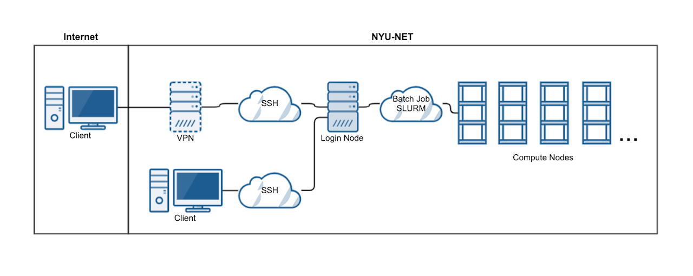

System
======

Overview
--------

The operating system on Jubail is Linux. Make sure you know the basics. Useful links:

* https://www.tutorialspoint.com/unix/index.htm
* http://linuxcommand.org/
* http://software-carpentry.org/lessons/
* https://www.edx.org/course/introduction-linux-linuxfoundationx-lfs101x-0

Generic diagram of the cluster architecture and outside connectivity.

Hardware
--------

The new HPC cluster includes the integration of previous HPC cluster Dalma with Jubail HPC cluster.

The Jubail HPC consists of more than 28K CPU cores, while Dalma HPC comprises over 12K. But it is very unlikely that your code can scale up to use them all (contact us directly if you are confident). From the user perspective, here are the important specifications for most nodes:

.. list-table::
    :widths: auto
    :header-rows: 1

    * - HPC Node
      - CPU Model
      - Cores per Node
      - Total Memory
      - Memory per Core
      - Serial Job Limit
      - Non-MPI Max Cores
      - MPI Multi-Node
    * - Jubail
      - AMD EPYC 7742 64-Core Processor @2.25GHz, supporting AVX2
      - 128
      - 480 GB
      - 3.75 GB
      - 1
      - 128
      - Use multiples of 128
    * - Dalma (28 cores)
      - Intel(R) Xeon(R) CPU E5-2680 v4 @ 2.40GHz, supporting AVX2
      - 28
      - 102 GB
      - 4 GB
      - 1
      - 28
      - Use multiples of 28
    * - Dalma (40 cores)
      - **CPU Model**
      - 40
      - 480 GB
      - **RAM GB**
      - 1
      - 40
      - Use multiples of 40

.. important::
  * **Serial job limit** means jobs with no threading should request only 1 core.
  * **Non-MPI Max Cores** means for jobs without MPI, stay within a single node.
  * **MPI multi-Node** ensures you utilize whole nodes, avoiding wasted resources, where the requested number of cores is divisible by the “Cores per Node” value.

Contact us if you need special configuration (extra large memory, GPU, etc...)

Typical Workflow
----------------

1. (One time only) Let us know your computational requirement.
2. (One time only) Apply an HPC account and pass our quiz.
3. If needed, transfer your input data to the HPC.
4. Log on to HPC login nodes.
5. Submit jobs from login nodes. 
6. Your jobs will queue for execution.
7. Once done, examine the output.

Summary of Nodes
----------------

.. list-table:: 
    :widths: auto 
    :header-rows: 1

    * - Node Type
      - Num Nodes
      - CPUs / Node
      - Memory / node
      - GPUs / node
      - Remarks
    * - Jubail Compute
      - 224
      - 128
      - 480GB
      - None
      - New HPC Compute nodes
    * - Jubail Gpu
      - 20
      - 128
      - 480GB
      - 1/2/3 (Nvidia A100)
      - New HPC GPU nodes
    * - Dalma Compute
      - 428
      - 28/40
      - 102 GB / 480 GB
      - None
      - Small jobs < 28 CPUs will be sent to Dalma
    * - Dalma GPUs
      - 14
      - 40
      - 360 GB / 1 TB
      - 2/8 (Nvidia V100)
      - Two nodes have 8 GPU cards each, rest of them have 2 cards each
    * - Bigmem
      - 5	
      - 32/64/72/128
      - 1 TB / 2TB	
      - None	
      - Used when memory requirement per node is greater than 500GB
    * - Visual	
      - 4	
      - 32	
      - 105 GB
      - 2 (Nvidia Quadro P4000)
      - Used for GUI 

	    

Access
------

Once your account is ready, you can access Jubail HPC with Linux or Mac in NYU AD/NY network. Simply ssh in your local terminal:

.. code-block:: bash

    ssh <NetID>@jubail.abudhabi.nyu.edu

If you use Windows or outside NYU AD/NY network, follow the instructions here: :doc:`Access Jubail <../system/access_jubail>`.

.. toctree::
 :hidden:

 /hpc/system/access_jubail

Whenever you login, you land up on one of the four login nodes, which is shown on left most section of
your terminal.It may look something like ``[wz22@login2 ~]$`` suggesting that you are on the second login node.

.. code-block:: bash

  Access allowed by pam_access
  - - - - - - - - - - - - - - - - - - - - - - - - - - - - - - - -
  Welcome to Jubail!

  For documentation & examples: https://crc-docs.abudhabi.nyu.edu
  For support: nyuad.it.help@nyu.edu
  - - - - - - - - - - - - - - - - - - - - - - - - - - - - - - - -
  Last login: Wed Feb 15 15:27:08 2023 from 10.224.42.159
  Disk quotas for wz22 (uid 3387153):
                             DISK SPACE                # FILES (1000's)
          filesystem       size      quota            number      quota
                      --------------------------   --------------------------
               /home    10099MB       20GB ( 49%)        77       150 ( 52%)
            /scratch       53GB     5000GB (  1%)        74       500 ( 15%)
            /archive       24GB     5120GB (  0%)         1       125 (  1%)
            
  [wz22@login2 ~]$

.. Important::
    Please refrain from running jobs on the login nodes. This can lead to your account getting suspended.

