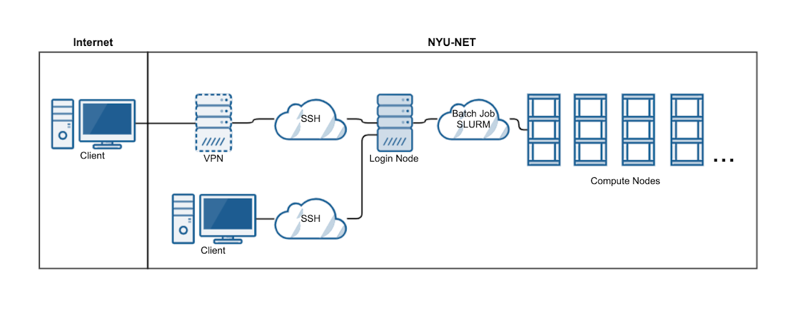

System
======

Overview
--------

The operating system on Jubail is Linux. Make sure you know the basics. Useful links:

* https://www.tutorialspoint.com/unix/index.htm
* http://linuxcommand.org/
* http://software-carpentry.org/lessons/
* https://www.edx.org/course/introduction-linux-linuxfoundationx-lfs101x-0

Generic diagram of the cluster architecture and outside connectivity.

Hardware
--------

The new HPC cluster includes the integration of previous HPC cluster Dalma with Jubail HPC cluster.

The Jubail HPC consists of more than 49K CPU cores. But it is very unlikely that your code can scale up to use them all (contact us directly if you are confident). From the user perspective, here are the important specifications for most nodes:

.. list-table::
    :widths: auto
    :header-rows: 1

    * - HPC Node
      - CPU Model
      - Cores per Node
      - Total Memory
      - Memory per Core
      - Serial Job Limit
      - Non-MPI Max Cores
      - MPI Multi-Node
    * - Bergamo
      - AMD EPYC 9754 128-Core Processor @2.25GHz, supporting AVX2
      - 256
      - 937 GB
      - 3.66 GB
      - 1
      - 256
      - Use multiples of 256
    * - Jubail
      - AMD EPYC 7742 64-Core Processor @2.25GHz, supporting AVX2
      - 128
      - 480 GB
      - 3.75 GB
      - 1
      - 128
      - Use multiples of 128
      
.. important::
  * **Serial job limit** means jobs with no threading should request only 1 core.
  * **Non-MPI Max Cores** means for jobs without MPI, stay within a single node.
  * **MPI multi-Node** ensures you utilize whole nodes, avoiding wasted resources, where the requested number of cores is divisible by the “Cores per Node” value.

Contact us if you need special configuration (extra large memory, GPU, etc...)

Typical Workflow
----------------

1. (One time only) Let us know your computational requirement.
2. (One time only) Apply an HPC account and pass our quiz.
3. If needed, transfer your input data to the HPC.
4. Log on to HPC login nodes.
5. Submit jobs from login nodes. 
6. Your jobs will queue for execution.
7. Once done, examine the output.

Summary of Nodes
----------------

Compute Nodes:
--------------
.. list-table::
    :widths: auto
    :header-rows: 1

    * - | 
        | Node Type
      - | 
        | Num Nodes
      - | CPUs / Node
      - | 
        | MEM / Node
        | (RAM)
      - |
        | ___________Remarks___________
    * - Bergamo
      - 58
      - 256
      - 1 TB
      - | 
        | AMD EPYC 9754
    * - Bigmem Jubail
      - 1
      - 128
      - 1 TB
      - | 
        | AMD EPYC 7742
        | 
        | Memory requirement > 480 GB
    * - Jubail
      - 233
      - 128
      - 480 GB
      - AMD EPYC 7742
    * - Bigmem Dalma
      - 4
      - 32 / 64 / 72
      - 1 TB / 2 TB
      - | 
        | AMD EPYC 7551
        | 
        | Intel(R) Xeon(R) CPU E7- 8837
        | 
        | Intel(R) Xeon(R) CPU E7-8867 v4
        | 
        | Memory requirement > 480 GB

GPU Nodes:
--------------
.. list-table::
    :widths: auto
    :header-rows: 1

    * - | 
        | Node Type
      - | 
        | Num Nodes
      - | 
        | CPUs / Node
      - | 
        | MEM / Node
        | (RAM)
      - | 
        | GPUs / Node
      - | 
        | MEM / GPU
        | (VRAM)
      - | 
        | Num GPUs
      - | 
        | ___________Remarks___________
    * - Jubail
      - 3
      - 64
      - 2 TB
      - 8
      - 141
      - 24
      - | 
        | Nvidia H200
        | 
        | Intel(R) Xeon(R) Platinum 8462Y+
        |
        | Intel(R) Xeon(R) Gold 6448Y
    * - Jubail
      - 4
      - 64
      - 1 TB / 2 TB
      - 2 / 7
      - 94
      - 13
      - | 
        | Nvidia H100
        | 
        | Intel(R) XEON(R) Gold 6548N
        |
        | AMD EPYC 7513
    * - Jubail
      - 36
      - 64 / 128
      - 480 GB
      - 1 / 2 / 3 / 4
      - 40 / 80
      - 101
      - | 
        | Nvidia A100
        | 
        | AMD EPYC 7543
        | 
        | AMD EPYC 7742
    * - Dalma 1TB
      - 2
      - 40
      - 1 TB
      - 8
      - 32
      - 16
      - | 
        | Nvidia Tesla V100
        | 
        | Intel(R) Xeon(R) Gold 6148 CPU
    * - Dalma
      - 11
      - 40
      - 320 GB / 384 GB
      - 2
      - 32
      - 22
      - | 
        | Nvidia Tesla V100
        | 
        | Intel(R) Xeon(R) Gold 6148 CPU

Visual Nodes:
--------------
.. list-table::
    :widths: auto
    :header-rows: 1

    * - | 
        | Node Type
      - | 
        | Num Nodes
      - | 
        | CPUs / Node
      - | 
        | MEM / Node
        | (RAM)
      - | 
        | GPUs / Node
      - | 
        | MEM / GPU
        | (VRAM)
      - | 
        | Num GPUs
      - | 
        | __Remarks__
    * - Visual
      - 4
      - 32
      - 112 GB
      - 2
      - 8
      - 8
      - GUI Nodes 

Access
------

Once your account is ready, you can access Jubail HPC with Linux or Mac in NYU AD/NY network. Simply ssh in your local terminal:

.. code-block:: bash

    ssh <NetID>@jubail.abudhabi.nyu.edu

If you use Windows or outside NYU AD/NY network, follow the instructions here: :doc:`Access Jubail <../system/access_jubail>`.

.. toctree::
 :hidden:

 /hpc/system/access_jubail

Whenever you login, you land up on one of the four login nodes, which is shown on left most section of
your terminal.It may look something like ``[wz22@login2 ~]$`` suggesting that you are on the second login node.

.. code-block:: bash

  Access allowed by pam_access
  - - - - - - - - - - - - - - - - - - - - - - - - - - - - - - - -
  Welcome to Jubail!

  For documentation & examples: https://crc-docs.abudhabi.nyu.edu
  For support: nyuad.it.help@nyu.edu
  - - - - - - - - - - - - - - - - - - - - - - - - - - - - - - - -
  Last login: Wed Feb 15 15:27:08 2023 from 10.224.42.159
  Disk quotas for wz22 (uid 3387153):
                          DISK SPACE                # FILES (1000's)
          filesystem       size      quota            number      quota
                      --------------------------   --------------------------
               /home       92KB       50GB (  0%)         0       500 (  0%)
            /scratch        4KB     5000GB (  0%)         0       500 (  0%)
            /archive        4KB     5120GB (  0%)         0       125 (  0%)
  [wz22@login2 ~]$

.. warning::
    Please refrain from running jobs or computationally intensive tasks on login nodes. Violations may result in account suspension. The following activities are also prohibited on login nodes: 
      - SSH reverse tunnels (ssh -R) or remote port forwarding.
      - VPNs, tunnels, or overlay networking (e.g., Cloudflare Tunnel, Tailscale, ZeroTier, ngrok).
      - Persistent background processes exposing login-node services externally.
      - Proxies, gateways, or services providing inbound access to the cluster.
      - Bypassing CRC network security controls, firewalls, VPN requirements, or approved access methods.

