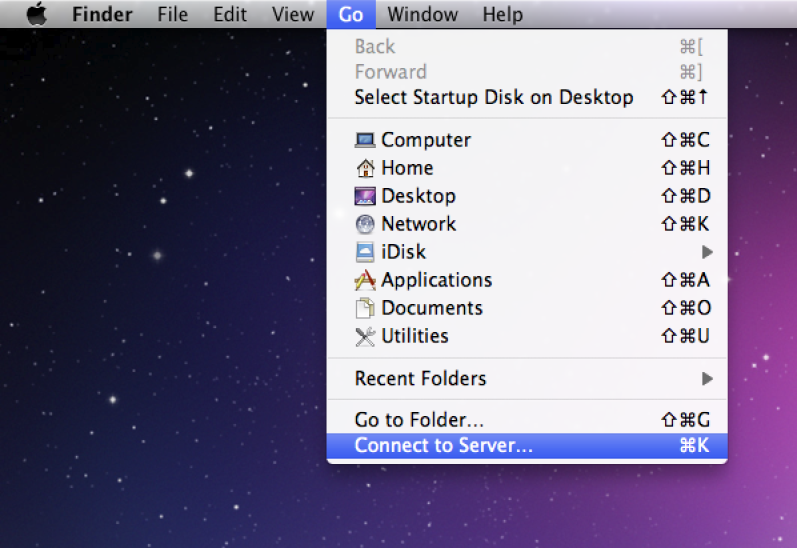
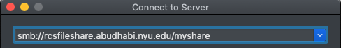
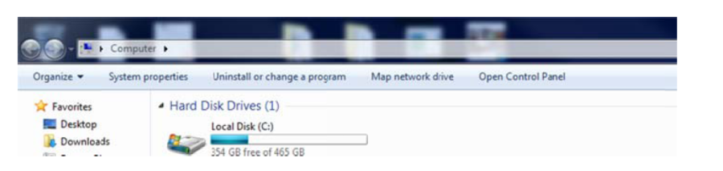
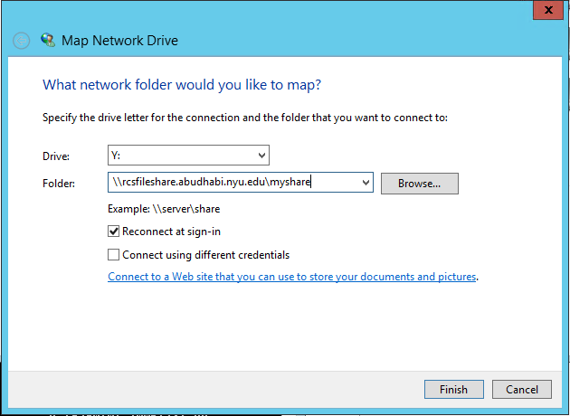
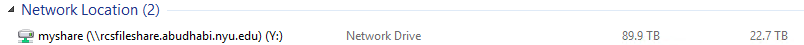

How to Map Shared Drive
=======================

MAC
-------

1. In **Finder**, select ``Connect to Server`` from **Go** menu

2. Type the following Windows File Share Address followed by the folder name:
    smb://rcsfileshare.abudhabi.nyu.edu/``<SHARE_FOLDER_NAME>``

3. In the below shown screen, type your NetID and password:

.. important:: 

    **Name** format should be NetID prefixed with ``ad\``. Example for ``fmk4``, **Name** should be ``ad\fmk4``.

.. image:: img/how_to_map_shared_drive/3.png

Windows
-------

1. Open **My Computer** window -> Select ``Map Network Drive``

2. Select Drive Letter; for example ``Y:`` Drive
3. Copy paste the link received by IT ( for example : ``\\rcsfileshare.abudhabi.nyu.edu\myshare`` ) 
4. Select ``Reconnect at Logon``
5. Click **Finish** 

The departmental drive will appear in **My Computer** window below ``Network Location`` Pane as shown below:

Ubuntu
------

.. code-block :: bash

    $ sudo apt-get install cifs-utils
    $ sudo mkdir /mnt/network
    $ sudo mount -t cifs //rcsfileshare.abudhabi.nyu.edu/<share_name> /mnt/network -o username=<netid>,sec=ntlmssp,vers=2.0

Centos
------
.. code-block :: bash

    $ sudo yum install cifs-utils
    $ sudo mkdir /mnt/network
    $ sudo mount -t cifs //rcsfileshare.abudhabi.nyu.edu/<share_name> /mnt/network -o username=<netid>,sec=ntlmssp,vers=2.0